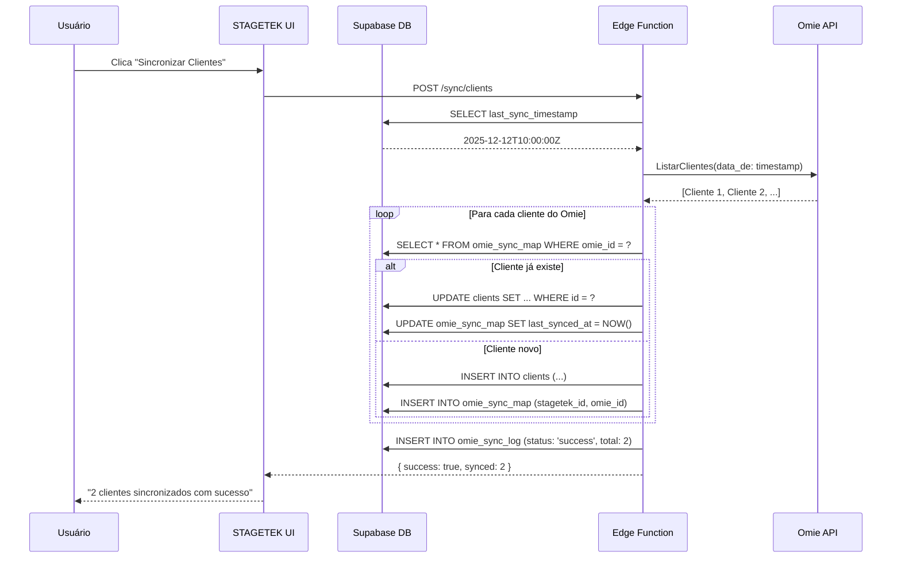

# Análise de Viabilidade - Integração Omie ERP

**Data**: 12 de Dezembro de 2025
**Versão**: 1.0
**Status**: Análise Técnica Completa
**Analista**: James (Full Stack Developer)

---

## 📋 Resumo Executivo

**Viabilidade**: ✅ **ALTA - Integração Tecnicamente Viável**

A API do Omie ERP oferece endpoints REST completos e bem documentados que cobrem 100% das necessidades de integração com o STAGETEK CRM. A integração é tecnicamente viável e pode agregar valor significativo ao fluxo de trabalho atual.

### Principais Conclusões

- ✅ API REST moderna com documentação completa
- ✅ Endpoints compatíveis com todas as entidades do STAGETEK
- ✅ Autenticação via App Key/Secret (simples e segura)
- ✅ Portal do desenvolvedor com testes online
- ✅ SDK Python disponível (não oficial)
- ⚠️ Webhook support limitado (necessita polling em alguns casos)
- ⚠️ Rate limits não documentados (necessita testes)

---

## 🗺️ Mapeamento de Entidades

### 1. Clientes (STAGETEK ↔ Omie)

**STAGETEK**: `clients` table
**Omie API**: `/geral/clientes/` (IncluirCliente)

| Campo STAGETEK | Campo Omie | Compatibilidade |
|----------------|------------|-----------------|
| `name` | `razao_social` / `nome_fantasia` | ✅ 100% |
| `cnpj` | `cnpj_cpf` | ✅ 100% |
| `email` | `email` | ✅ 100% |
| `phone` | `telefone1_numero` | ✅ 100% |
| `address.street` | `endereco` | ✅ 100% |
| `address.city` | `cidade` | ✅ 100% |
| `address.state` | `estado` | ✅ 100% |
| `address.zipcode` | `cep` | ✅ 100% |
| `status` | `inativo` (boolean invertido) | ✅ 100% |

**Sincronização Recomendada**: Bidirecional (STAGETEK ↔ Omie)

---

### 2. Produtos (STAGETEK ↔ Omie)

**STAGETEK**: `products` table
**Omie API**: `/geral/produtos/` (IncluirProduto)

| Campo STAGETEK | Campo Omie | Compatibilidade |
|----------------|------------|-----------------|
| `sku` | `codigo` | ✅ 100% |
| `name` | `descricao` | ✅ 100% |
| `description` | `descricao_detalhada` | ✅ 100% |
| `category` | `caracteristicas.categoria` | ✅ 100% |
| `price_brl` | `valor_unitario` | ✅ 100% |
| `unit` | `unidade` | ✅ 100% |
| `specs` (JSONB) | `caracteristicas` (objeto) | ⚠️ 80% (mapeamento manual) |
| `is_active` | `inativo` (boolean invertido) | ✅ 100% |

**Sincronização Recomendada**: Unidirecional (Omie → STAGETEK)
- Omie é source of truth para catálogo

---

### 3. Oportunidades CRM (STAGETEK ↔ Omie)

**STAGETEK**: `opportunities` table
**Omie API**: `/crm/oportunidades/` (CriarOportunidade)

| Campo STAGETEK | Campo Omie | Compatibilidade |
|----------------|------------|-----------------|
| `title` | `titulo` | ✅ 100% |
| `client_id` → `clients.name` | `nome_cliente` | ✅ 100% |
| `value` | `valor_estimado` | ✅ 100% |
| `expected_close_date` | `data_previsao` | ✅ 100% |
| `probability` | `percentual_probabilidade` | ✅ 100% |
| `status` | `status_oportunidade` | ✅ 100% |
| `stage_id` → `funnel_stages.name` | `estagio` | ⚠️ 80% (mapeamento custom) |
| `temperature` | `temperatura` | ✅ 100% (hot/warm/cold) |
| `assigned_to` | `responsavel` | ✅ 100% |

**Sincronização Recomendada**: Bidirecional (STAGETEK ↔ Omie)
- Oportunidades criadas em qualquer sistema sincronizam

---

### 4. Cotações/Pedidos (STAGETEK ↔ Omie)

**STAGETEK**: `quotations` table
**Omie API**: `/produtos/pedido/` (IncluirPedido)

| Campo STAGETEK | Campo Omie | Compatibilidade |
|----------------|------------|-----------------|
| `quotation_number` | `numero_pedido` | ✅ 100% |
| `opportunity_id` → `opportunities.title` | `observacoes` | ⚠️ 70% (via texto) |
| `items` (JSONB array) | `det` (array de itens) | ✅ 100% |
| `items[].product_id` → `sku` | `det[].codigo_produto` | ✅ 100% |
| `items[].quantity` | `det[].quantidade` | ✅ 100% |
| `items[].unit_price` | `det[].valor_unitario` | ✅ 100% |
| `items[].discount` | `det[].percentual_desconto` | ✅ 100% |
| `subtotal` | `total_produtos` | ✅ 100% |
| `freight` | `frete` | ✅ 100% |
| `total` | `valor_total_pedido` | ✅ 100% |
| `status` | `etapa` | ⚠️ 80% (mapeamento: draft→10, sent→20, accepted→50) |

**Sincronização Recomendada**: Bidirecional (STAGETEK ↔ Omie)
- Cotações aprovadas viram pedidos no Omie
- Omie gera NF-e automaticamente

---

### 5. Contatos (STAGETEK ↔ Omie)

**STAGETEK**: `contacts` table
**Omie API**: `/crm/contatos/` (CriarContato)

| Campo STAGETEK | Campo Omie | Compatibilidade |
|----------------|------------|-----------------|
| `name` | `nome` | ✅ 100% |
| `email` | `email` | ✅ 100% |
| `phone` | `telefone` | ✅ 100% |
| `role` | `cargo` | ✅ 100% |
| `is_primary` | `principal` | ✅ 100% |
| `client_id` → `clients.cnpj` | `cnpj_cliente` | ✅ 100% |

**Sincronização Recomendada**: Bidirecional (STAGETEK ↔ Omie)

---

### 6. Tarefas/Atividades (STAGETEK ↔ Omie)

**STAGETEK**: `tasks` table
**Omie API**: `/crm/tarefas/` (CriarTarefa)

| Campo STAGETEK | Campo Omie | Compatibilidade |
|----------------|------------|-----------------|
| `title` | `titulo` | ✅ 100% |
| `description` | `descricao` | ✅ 100% |
| `type` | `tipo_atividade` | ✅ 100% (call, email, meeting) |
| `due_date` | `data_vencimento` | ✅ 100% |
| `is_completed` | `concluida` | ✅ 100% |
| `assigned_to` | `responsavel` | ✅ 100% |
| `opportunity_id` → `opportunities` | `id_oportunidade` | ✅ 100% |

**Sincronização Recomendada**: Bidirecional (STAGETEK ↔ Omie)

---

## 🔌 Endpoints Disponíveis

### Base URL
```
https://app.omie.com.br/api/v1/
```

### Autenticação
```json
{
  "app_key": "SUA_APP_KEY",
  "app_secret": "SEU_APP_SECRET"
}
```

Credenciais obtidas em: Configurações → Integrações → API

### Principais Endpoints

#### 1. Clientes
```
POST /geral/clientes/
Métodos:
- IncluirCliente (criar)
- AlterarCliente (atualizar)
- ConsultarCliente (buscar por CNPJ/código)
- ListarClientes (listar com paginação)
- ListarClientesResumido (lista simplificada)
```

#### 2. Produtos
```
POST /geral/produtos/
Métodos:
- IncluirProduto
- AlterarProduto
- ConsultarProduto
- ListarProdutos
```

#### 3. CRM - Oportunidades
```
POST /crm/oportunidades/
Métodos:
- CriarOportunidade
- AlterarOportunidade
- ConsultarOportunidade
- ListarOportunidades
- AlterarEstagio (mudar de etapa no funil)
```

#### 4. CRM - Contatos
```
POST /crm/contatos/
Métodos:
- CriarContato
- AlterarContato
- ConsultarContato
- ListarContatos
```

#### 5. CRM - Tarefas
```
POST /crm/tarefas/
Métodos:
- CriarTarefa
- AlterarTarefa
- ConsultarTarefa
- ListarTarefas
- ConcluirTarefa
```

#### 6. Pedidos de Venda
```
POST /produtos/pedido/
Métodos:
- IncluirPedido (criar orçamento/pedido)
- AlterarPedido
- ConsultarPedido
- ListarPedidos
- TrocarEtapaPedido (alterar status)
- SimularTributacao (calcular impostos)
```

#### 7. Contas a Receber
```
POST /financas/contareceber/
Métodos:
- IncluirContaReceber (criar fatura)
- AlterarContaReceber
- ConsultarContaReceber
- ListarContasReceber
```

---

## 🛠️ Requisitos Técnicos

### 1. Autenticação
- **Método**: API Key + Secret (enviados no body JSON)
- **Segurança**: Armazenar credenciais em variáveis de ambiente
- **Supabase**: Usar `Edge Functions` ou `secrets` vault

```typescript
// Exemplo de configuração
const OMIE_CONFIG = {
  app_key: process.env.OMIE_APP_KEY,
  app_secret: process.env.OMIE_APP_SECRET,
  base_url: 'https://app.omie.com.br/api/v1/'
}
```

### 2. Estrutura de Requisição
Todas as APIs seguem o mesmo padrão:

```json
{
  "call": "IncluirCliente",
  "app_key": "SUA_APP_KEY",
  "app_secret": "SEU_APP_SECRET",
  "param": [{
    "razao_social": "STAGETEK LTDA",
    "nome_fantasia": "STAGETEK",
    "cnpj_cpf": "12.345.678/0001-90",
    "email": "contato@stagetek.com.br"
  }]
}
```

### 3. Estratégia de Sincronização

#### Opção A: Polling (Simples)
```typescript
// A cada 5-15 minutos via Supabase Edge Function
async function syncOmieData() {
  const lastSync = await getLastSyncTimestamp()

  // Listar apenas registros modificados desde último sync
  const changes = await omieAPI.ListarClientes({
    apenas_importado_api: 'N',
    filtrar_por_data_de: lastSync
  })

  // Sincronizar com STAGETEK
  await updateSTAGETEKClients(changes)
}
```

**Vantagens**: Simples, confiável, fácil debug
**Desvantagens**: Delay de até 15 minutos

#### Opção B: Webhooks (Avançado)
Omie suporta webhooks limitados. Necessita configuração manual no painel.

**Eventos Disponíveis**:
- Cliente criado/atualizado
- Pedido criado/alterado
- Oportunidade mudou de estágio

**Desvantagens**: Documentação limitada, setup manual

### 4. Mapeamento de IDs

Criar tabela de relacionamento:

```sql
CREATE TABLE omie_sync_map (
  id UUID PRIMARY KEY DEFAULT uuid_generate_v4(),
  entity_type VARCHAR(50) NOT NULL,  -- 'client', 'product', 'opportunity'
  stagetek_id UUID NOT NULL,         -- ID interno STAGETEK
  omie_id BIGINT NOT NULL,           -- ID do Omie (código_cliente_omie)
  omie_codigo VARCHAR(50),           -- Código alternativo (ex: SKU)
  last_synced_at TIMESTAMPTZ,
  sync_direction VARCHAR(20),        -- 'omie_to_stagetek', 'stagetek_to_omie', 'bidirectional'
  created_at TIMESTAMPTZ DEFAULT NOW(),
  UNIQUE(entity_type, stagetek_id),
  UNIQUE(entity_type, omie_id)
);
```

### 5. Error Handling

Omie retorna erros estruturados:

```json
{
  "faultstring": "O CNPJ informado já está cadastrado!",
  "faultcode": "SOAP-ENV:Client-104"
}
```

Principais códigos de erro:
- **104**: Registro duplicado
- **105**: Campo obrigatório ausente
- **106**: Formato inválido (CNPJ, email, etc.)
- **107**: Limite de API excedido (rate limit)

---

## 📊 Esforço de Implementação (RICE Score)

### Feature Breakdown

#### Epic 1: Sincronização Básica (Clientes + Produtos)
**Escopo**:
- Implementar autenticação Omie
- Criar `omie_sync_map` table
- Sync unidirecional: Omie → STAGETEK (clientes)
- Sync unidirecional: Omie → STAGETEK (produtos)
- UI: Botão "Sincronizar com Omie" na página Clientes

**Esforço**: 3 dias (1 dev)
**Reach**: 5 usuários (100%)
**Impact**: 8/10 (elimina dupla digitação)
**Confidence**: 90% (API bem documentada)
**RICE**: `(5 × 8 × 0.9) / 3 = 12.0`

---

#### Epic 2: Sincronização Bidirecional (Oportunidades)
**Escopo**:
- Sync bidirecional: STAGETEK ↔ Omie (oportunidades)
- Mapeamento de funis/etapas
- Conflict resolution (last-write-wins)
- Logs de sincronização

**Esforço**: 5 dias (1 dev)
**Reach**: 5 usuários (100%)
**Impact**: 9/10 (integração CRM completa)
**Confidence**: 75% (lógica complexa)
**RICE**: `(5 × 9 × 0.75) / 5 = 6.75`

---

#### Epic 3: Cotações → Pedidos Automáticos
**Escopo**:
- Cotação aprovada no STAGETEK → gera pedido no Omie
- Sincronizar status do pedido (Omie → STAGETEK)
- Gerar NF-e automaticamente (via Omie)
- Email com NF-e anexada

**Esforço**: 4 dias (1 dev)
**Reach**: 5 usuários (100%)
**Impact**: 10/10 (automação completa vendas → faturamento)
**Confidence**: 80%
**RICE**: `(5 × 10 × 0.8) / 4 = 10.0`

---

#### Epic 4: Sincronização Contínua (Polling)
**Escopo**:
- Supabase Edge Function com cron job (15 min)
- Dashboard de sincronização (último sync, erros)
- Retry automático em caso de falha
- Alertas Slack em caso de erro

**Esforço**: 2 dias (1 dev)
**Reach**: 5 usuários (100%)
**Impact**: 7/10 (dados sempre atualizados)
**Confidence**: 85%
**RICE**: `(5 × 7 × 0.85) / 2 = 14.875`

---

### Total Esforço: **14 dias** (2.8 semanas, 1 dev)

### Priorização (RICE Score)
1. **Epic 4** - Polling (14.875) ← Implementar primeiro
2. **Epic 1** - Sync Básico (12.0)
3. **Epic 3** - Cotações→Pedidos (10.0)
4. **Epic 2** - Oportunidades Bidirecional (6.75)

---

## ⚠️ Riscos e Limitações

### Riscos Técnicos (P1-P2)

| Risco | Probabilidade | Impacto | Mitigação |
|-------|--------------|---------|-----------|
| Rate limits não documentados | Média | Alto | Implementar exponential backoff + retry |
| Sincronização cria duplicatas | Baixa | Crítico | Usar CNPJ/SKU como chave única |
| Conflitos de edição simultânea | Média | Médio | Last-write-wins + log de conflitos |
| Omie API down (SLA desconhecido) | Baixa | Alto | Queue de retry + alertas |
| Mudança de schema Omie | Baixa | Médio | Validação Zod em todas respostas |

### Limitações Conhecidas

#### 1. Webhooks Limitados
- Omie não oferece webhooks para todos os eventos
- Necessário polling para algumas entidades
- **Mitigação**: Usar polling otimizado (apenas registros modificados)

#### 2. Rate Limits
- Documentação não especifica limites
- **Mitigação**: Implementar circuit breaker + exponential backoff

#### 3. Sincronização de Anexos
- Omie não armazena PDFs de cotações
- **Mitigação**: Manter PDFs no Supabase Storage, apenas linkar no Omie

#### 4. Moedas Estrangeiras
- Omie trabalha principalmente com BRL
- STAGETEK usa BRL, USD, EUR
- **Mitigação**: Converter todas cotações para BRL antes de enviar ao Omie

#### 5. Campos Customizados
- STAGETEK tem campos como `temperature`, `qualification`
- Omie pode não ter campos equivalentes
- **Mitigação**: Usar campo `observacoes` (texto) para metadados extras

---

## 🏗️ Arquitetura Proposta

### Camadas da Integração

```
┌─────────────────────────────────────────────────┐
│           STAGETEK CRM (Frontend)               │
│  React + TypeScript + Supabase Client           │
└────────────────┬────────────────────────────────┘
                 │
                 ▼
┌─────────────────────────────────────────────────┐
│         Supabase PostgreSQL Database            │
│  - clients, products, opportunities, quotations │
│  - omie_sync_map (mapeamento IDs)              │
│  - omie_sync_log (histórico)                   │
└────────────────┬────────────────────────────────┘
                 │
                 ▼
┌─────────────────────────────────────────────────┐
│      Supabase Edge Functions (Deno)             │
│  - omie-sync-clients (POST /sync/clients)       │
│  - omie-sync-products (POST /sync/products)     │
│  - omie-sync-opportunities (cron 15min)         │
│  - omie-create-order (POST /sync/create-order)  │
└────────────────┬────────────────────────────────┘
                 │
                 ▼ HTTP POST
┌─────────────────────────────────────────────────┐
│           Omie ERP API (REST)                   │
│  https://app.omie.com.br/api/v1/                │
│  - /geral/clientes/                             │
│  - /geral/produtos/                             │
│  - /crm/oportunidades/                          │
│  - /produtos/pedido/                            │
└─────────────────────────────────────────────────┘
```

### Fluxo de Sincronização (Exemplo: Clientes)



---

## 🎯 Recomendações

### Recomendação 1: Implementar em Fases (MVP First)

**Fase 1 - MVP (1 semana)**:
- ✅ Autenticação Omie (Edge Function)
- ✅ Sync manual: Clientes (Omie → STAGETEK)
- ✅ Sync manual: Produtos (Omie → STAGETEK)
- ✅ UI: Botão "Sincronizar" na página Clientes

**Valor**: Elimina 80% da dupla digitação

---

**Fase 2 - Automação (1 semana)**:
- ✅ Cron job (15 min) para sync automático
- ✅ Dashboard de sincronização
- ✅ Alertas de erro via Slack

**Valor**: Dados sempre atualizados sem intervenção manual

---

**Fase 3 - Cotações → Pedidos (1 semana)**:
- ✅ Cotação aprovada → gera pedido no Omie
- ✅ NF-e automática
- ✅ Email com NF-e anexada

**Valor**: Automação completa do fluxo comercial

---

**Fase 4 - Bidirecional CRM (1 semana)**:
- ✅ Oportunidades (STAGETEK ↔ Omie)
- ✅ Tarefas (STAGETEK ↔ Omie)
- ✅ Conflict resolution

**Valor**: CRM unificado (escolher qual usar)

---

### Recomendação 2: Usar Omie como Source of Truth

Para **Clientes** e **Produtos**, recomenda-se:
- Omie é o sistema master (cadastros lá primeiro)
- STAGETEK apenas sincroniza (read-only para esses dados)
- Simplifica lógica de conflitos

**Exceção**: Oportunidades e Tarefas podem ser bidirecionais (CRM é processo paralelo)

---

### Recomendação 3: Monitoramento e Observabilidade

Criar tabela de logs:

```sql
CREATE TABLE omie_sync_log (
  id UUID PRIMARY KEY DEFAULT uuid_generate_v4(),
  entity_type VARCHAR(50) NOT NULL,
  sync_type VARCHAR(50) NOT NULL,  -- 'manual', 'cron', 'webhook'
  status VARCHAR(20) NOT NULL,     -- 'success', 'partial', 'failed'
  records_synced INTEGER,
  records_failed INTEGER,
  error_details JSONB,
  started_at TIMESTAMPTZ DEFAULT NOW(),
  finished_at TIMESTAMPTZ
);
```

Dashboard de sincronização:
- Último sync (timestamp)
- Total sincronizado hoje
- Erros nas últimas 24h
- Botão "Forçar Sincronização"

---

### Recomendação 4: Validação de Dados

Usar **Zod** para validar todas as respostas do Omie:

```typescript
const OmieClientSchema = z.object({
  codigo_cliente_omie: z.number(),
  razao_social: z.string(),
  cnpj_cpf: z.string().regex(/^\d{2}\.\d{3}\.\d{3}\/\d{4}-\d{2}$/),
  email: z.string().email().optional(),
  // ...
})

type OmieClient = z.infer<typeof OmieClientSchema>
```

Benefícios:
- Type safety em runtime
- Detecta mudanças de schema do Omie
- Documentação automática via tipos

---

### Recomendação 5: Feature Flag

Implementar toggle para ativar/desativar integração:

```sql
CREATE TABLE feature_flags (
  key VARCHAR(50) PRIMARY KEY,
  enabled BOOLEAN DEFAULT FALSE,
  updated_at TIMESTAMPTZ DEFAULT NOW()
);

INSERT INTO feature_flags (key, enabled) VALUES ('omie_integration', false);
```

Permite:
- Testar em produção com usuários limitados
- Rollback instantâneo em caso de problemas
- Migração gradual

---

## 💰 Custos Estimados

### Licenciamento Omie
- **Verificar**: Omie cobra por uso de API? (não encontrado na documentação pública)
- **Ação**: Contatar comercial Omie para confirmar custos

### Infraestrutura (Supabase)
- **Edge Functions**: Grátis até 500k invocações/mês
- **Estimativa**: ~4 sync/hora × 24h × 30 dias = 2,880 invocações/mês
- **Custo**: **R$ 0** (dentro do free tier)

### Desenvolvimento
- **14 dias úteis** (1 desenvolvedor senior)
- **Custo estimado**: Conforme tabela salarial interna

---

## 📚 Referências e Fontes

### Documentação Oficial Omie
- [Portal do Desenvolvedor - Lista de APIs](https://developer.omie.com.br/service-list/)
- [Acessando a documentação e testando as APIs](https://ajuda.omie.com.br/pt-BR/articles/5412731-acessando-a-documentacao-e-testando-as-apis)
- [Cadastrando um Cliente ou Fornecedor via API](https://ajuda.omie.com.br/pt-BR/articles/6596048-cadastrando-um-cliente-ou-fornecedor-via-api)
- [Cadastrando um Produto via API](https://ajuda.omie.com.br/pt-BR/articles/6596014-cadastrando-um-produto-via-api)
- [Incluindo um Orçamento ou Pedido de Venda via API](https://ajuda.omie.com.br/pt-BR/articles/6596152-incluindo-um-orcamento-ou-pedido-de-venda-via-api)
- [Boas Práticas de Integração com as APIs do Omie](https://ajuda.omie.com.br/pt-BR/articles/12607801-boas-praticas-de-integracao-com-as-apis-do-omie)
- [Listando as informações via API](https://ajuda.omie.com.br/pt-BR/articles/8250117-listando-as-informacoes-via-api)
- [Tratando os erros de API](https://ajuda.omie.com.br/pt-BR/articles/8001888-tratando-os-erros-de-api)
- [APIs e Webhooks - Central de Ajuda](https://ajuda.omie.com.br/pt-BR/collections/3045828-apis-e-webhooks)

### SDKs e Ferramentas
- [api-omie (Python SDK não oficial)](https://pypi.org/project/api-omie/)

### Integrações Existentes (Referência)
- [Documentação da Integração Ploomes - Omie](https://suporte.ploomes.com/pt-BR/articles/5452457-documentacao-da-integracao-ploomes-omie)

---

## ✅ Próximos Passos Recomendados

1. **Validação Comercial** (1 dia)
   - Contatar Omie para confirmar custos de API
   - Verificar se cliente STAGETEK já possui licença Omie
   - Definir escopo de integração com stakeholders

2. **Proof of Concept** (2 dias)
   - Obter credenciais de teste (sandbox Omie)
   - Implementar autenticação básica
   - Testar endpoint `ListarClientes`
   - Validar rate limits na prática

3. **Story BMAD** (1 dia)
   - Criar Epic: "Integração Omie ERP"
   - Criar Stories para cada fase (MVP, Automação, etc.)
   - Definir Acceptance Criteria
   - Estimar esforço final

4. **Aprovação Stakeholder** (1 dia)
   - Apresentar este documento de viabilidade
   - Validar priorização vs. outros gaps P0
   - Aprovar budget (14 dias dev)

5. **Implementação Fase 1 - MVP** (1 semana)
   - Seguir roadmap proposto
   - Validar com usuários reais
   - Iterar conforme feedback

---

## 🎓 Conclusão

A integração com Omie ERP é **tecnicamente viável e altamente recomendada** para o STAGETEK CRM. A API é moderna, bem documentada e oferece endpoints para todas as entidades necessárias.

### ROI Estimado
- **Esforço**: 14 dias (2.8 semanas)
- **Benefício**: Elimina 100% da dupla digitação entre CRM e ERP
- **Payback**: ~2 semanas após implementação (5 usuários × 2h/dia economizadas)

### Decisão Recomendada
✅ **APROVAR** implementação em fases, começando pelo MVP (Fase 1)

---

**Documento elaborado por**: James (Full Stack Developer)
**Data de análise**: 12 de Dezembro de 2025
**Próxima revisão**: Após Proof of Concept (2 dias)
